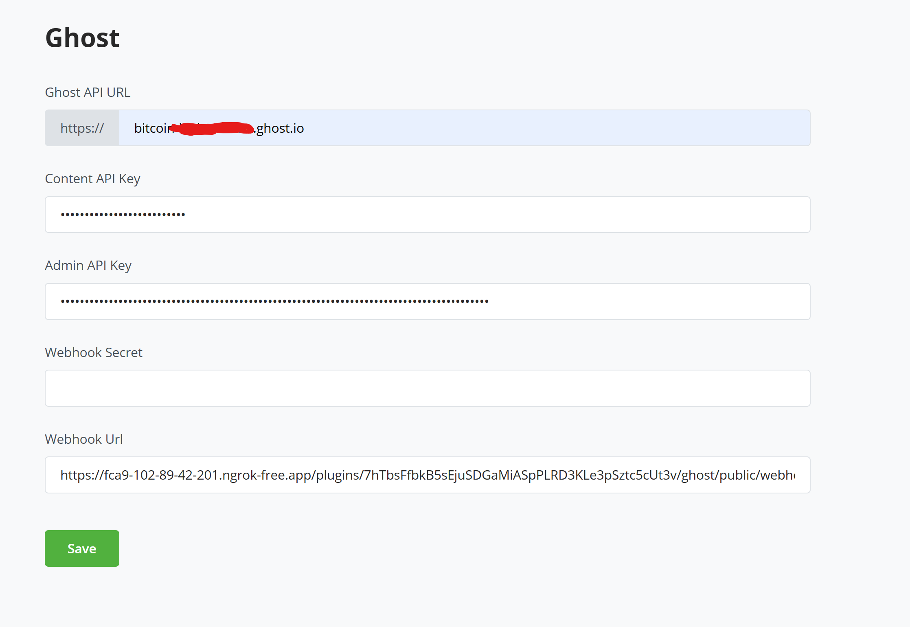
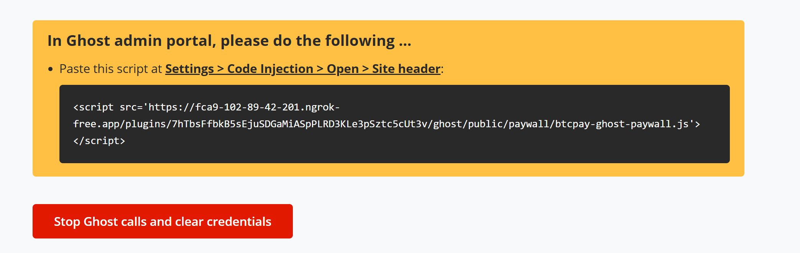
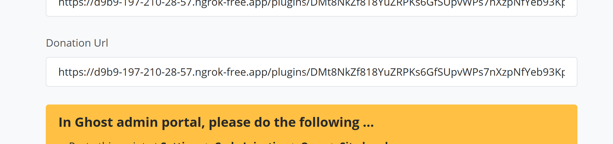
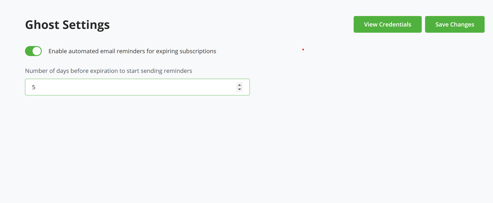
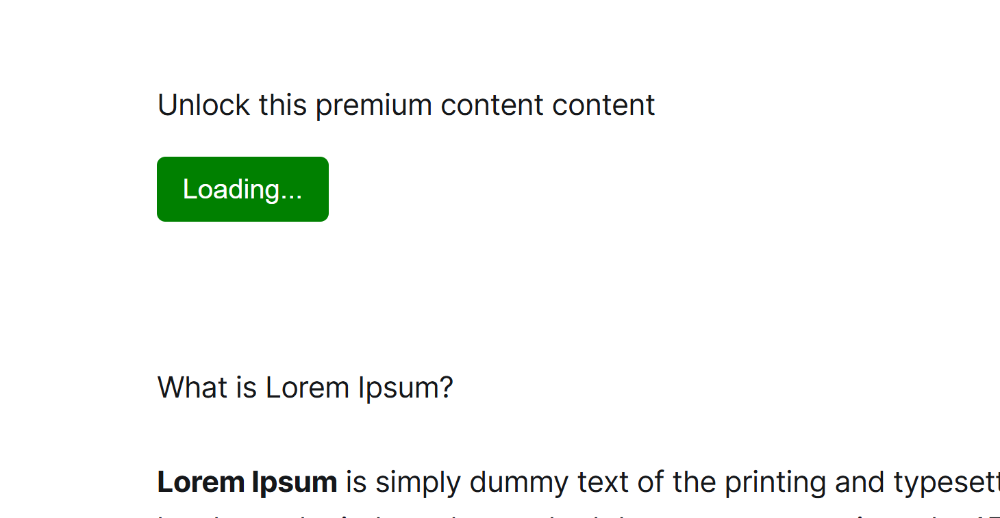
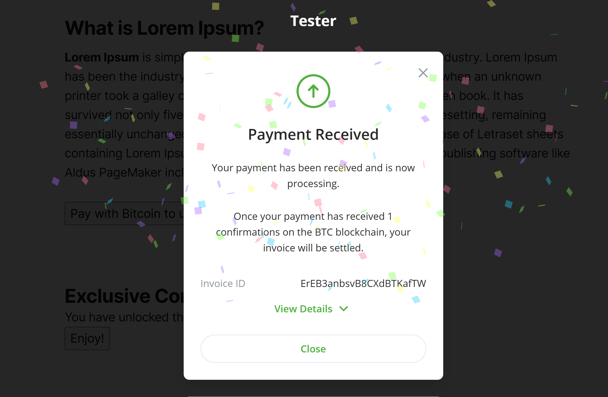

# Accept Bitcoin on Your Ghost Blog Today 

Tired of relying on Stripe for your Ghost platform and want to try something new? Do you want to receive payment from your Ghost blog in Bitcoin, of course without an 
fees and third party?

Introducing BTCPay Server for Ghost – a plugin that allows you accept bitcoin payments directly on your blog from customers with no fee.

Monetizing your content should be simple, and free from third-party fees. Our integration with Ghost allows you to connect your self-hosted BTCPay Server with your 
[Ghost blog](https://ghost.org/), enabling you accept Bitcoin payments swiftly and securely, while keeping you in full control of your funds.

Whether you’re receiving donations, selling tiered memberships or use it to make a paywall and accept micropayments, this integration ensures seamless Bitcoin payments without third-party fees.


🔹 Seamless Integration – Connect your Ghost blog to BTCPay Server in just a few clicks.

🔹 Zero Fees, Full Control – No third-party processing, just direct Bitcoin payments to your wallet.

🔹 Perfect for Creators – Monetize your blog with Bitcoin-based memberships and content access.

💡 Ready to power your blog with Bitcoin? Set up your BTCPay Server and start accepting payments


## Prerequisites:

Before diving into the setup process, ensure you have the following:

- [A Ghost account](https://ghost.org/) or [self-hosted Ghost instance](https://ghost.org/docs/install/).
- BTCPay Server - [self-hosted](Deployment.md) or run by a [third-party host](/Deployment/ThirdPartyHosting.md) v2.0.0 or later.
- [Created BTCPay Server store](CreateStore.md) with [wallet set up](WalletSetup.md)


## Setting up BTCPay Server with Ghost

1. Login to your BTCPay Server instance, Plugins > Manage Plugins

2. Search for and install BTCPay Server plugin for Ghost

3. Once installed you should see Ghost, included in the side nav, under plugins

4. Log in to your Ghost Admin Panel on a new tab

5. Navigate to Settings (cogwheel at the bottom), in section "Advanced" click on "Integrations". Click "Add custom integration" and name it e.g "BTCPay Server"
      
      

6. A modal will show the required Ghost credentials needed by the plugin
   

7. Click on "Save" to save your credentials, you can also put in a description before saving it.

8. Open up your BTCPay Server instance, make sure you selected the right store and open the Ghost plugin page.

9. Copy your API Url (without the https://), Content API key, and Admin API Key from Ghost credential page into their respective input fields in your plugin page.

10. For the username/email and password fields, enter your Ghost admin email address, and password.

11. For the Webhook Secret you can enter a secret on your own or if left empty it will auto-generate one. This will only be used for the membership functionality.

12. Now save the credentials details on BTCPay Server Ghost Plugin. If all data is correct, it should save successfully.

   


13. On BTCPay, go to your Ghost plugin page, copy the script snippet from the bottom of the page. Open your Ghost admin portal: Settings >> Code Injection, open code injection and under site header paste the script url, save and close
 
 


If you got here without any hassle, congratulations on successfully installing the plugin. 

In case you encountered any issue you can report them [here](https://github.com/TChukwuleta/BTCPayServerPlugins/issues) (prefix "Ghost" to title of the issue)

### Uninstalling
You can discontinue the plugin by clicking on the "Stop Ghost calls and clear credentials" button, and also deleting the custom integration that you created.

## 🎯 What can I do with the BTCPay-Ghost plugin?

Congratulations once again on installing your plugin successfully. Whether you’re a blogger, a business owner, or an event organizer, 

the Ghost - BTCPay Server plugin unlocks new revenue streams.

1. Accept Donations – Allow readers support your work with donations in Bitcoin.

2. Paywall Content – Restrict access to premium articles, videos, or other content, unlocking it through Bitcoin payments.

3. Tiered Membership Creation and Subscriptions - Offer exclusive content to members and subscribers in a tier.

Each use case comes with an easy setup guide to help you get started quickly. Let’s dive into the details.


### Receiving Donations on Ghost through BTCPay Server

With BTCPay Server, you can accept Bitcoin donations directly on your Ghost blog — no intermediaries, no processing fees, just a seamless way for your audience to support your work.

Whether you're a blogger, journalist, or content creator, adding a Bitcoin donation option gives your supporters an easy way to contribute, while ensuring you maintain full control over your funds.


#### Steps on how to receive donations on Ghost via BTCPay Server.

1. Go to your BTCPay Server Ghost plugin, scroll down the page, you'd see "Donation Url", copy the URL.

2. Open your ghost admin page where you want to receive donations. You may be open to receiving donations on every content page of your Ghost blog, or on a single page dedicated to donations. Which ever you choose, 
   accepting donations is pretty straightforward. Go to the editor of your donation page (or any page). Add a new button (by clicking the (+) sign) with a title of your choice e.g Buy me a coffee in Bitcoin, for the Bitcoin URL, paste the
   Donation URL you copied, and paste it there. Save and publish your page.

3. When you go to the URL of the page, you should see the button now, click on the button, and a QR code would be displayed on the screen. Users can then scan this QR and support 
   you with any amount they want to. 
   
4. If you check your BTCPay Server invoice, you should see your new donation, received in your wallet. Voila!!!





### Membership and subscription BTCPay Server


Beyond accepting donations, if you are looking to monetize your content, community, or services with Bitcoin, this plugin also offers you the opportunity to do so. Following the steps below, you should be able to now accept Bitcoin for membership creation and subscriptions.

Ghost doesn’t provide a direct way to integrate custom payment providers. Instead, it relies on a private API for payment processing, which is currently built around Stripe as the default processor.

Why does this matter? While BTCPay Server can handle subscriptions and send notifications to the users, it cannot automatically deactivate or delete members in Ghost once a subscription ends. 

This means subscription management remains the admin’s responsibility. However, you can configure the Ghost plugin to send automated notifications to the customer when a subscription is nearing expiration, allowing for timely action.


#### Setting up membership subscription via BTCPay Server


1. Head to your BTCPay Server Ghost plugin, scroll down on the page, copy the 'Membership subscription Url'.

      

2. Head over to your Ghost admin portal, click on Settings >> Portal Settings, click on the 'Customize' button.

   

      

3. Edit the field at 'Display notice at signup' in the right sidebar and to include instructions on how to signup with Bitcoin as payment option, directing users to use the link. For instance: "Sign up with Bitcoin using this link". **Important**: Mark "this link" with your mouse and add a link with the URL copied from the plugin.
   

4. Save the changes and the close to the portal. You can navigate to the signup page to view your changes. It should look similar to this:   
   

5. Before we proceed to testing it out, we need to configure webhooks for our integrations, these webhook would alert the plugin for when member's data are updated or deleted. 

6. Go to your Ghost plugin view in BTCPay Server, and note down/copy the 'Webhook Secret' and 'Webhook Url' values.

7. In your Ghost admin portal, navigate to Settings >> Integrations. Select the custom integration you earlier created.

8. Click on 'Add webhook'. Enter a name for the webhook, for the event, select 'Member Updated', paste the URL copied into the 'Target URL' and secret into 'Secret' fields. Click on "Add".
   

9. Create another webhook, this time the event would be 'Member Deleted'. Use the same URL and Secret for the 'Target URL' and 'Secret' and click on "Add" again.
   

10. Once you can confirm that both your webhooks has been populated, click on 'Save' and close the modal.
	

#### Testing the membership subscription

1. Users can then proceed to create membership and pay via BTCPay Server. When a user clicks on the link, he is redirected to a page where he can select his tier.
   

2. The user is prompted to enter their name and email, and also prompted to select their tier to which they need to subscribe to.
   

3. Once he is done filling his details, he then clicks on subscribe which would show an invoice containing his first payment to subscribe to being a member.

4. Once the invoice has been paid, a member account is created by the user on the Ghost platform, the user can then proceed to log in.


#### Managing Members and Subscriptions

1. The admin can view all subscribed members by heading over to the BTCPay Server >> Ghost plugin >> Ghost members.
      
2. The admin can see all members, members with active subscription, members whose subscription would soon expire, and members whose subscription has expired.
      

3. A member subscription is tagged as 'soon to expire' when the subscription ends a few days away from the end date. The days specification can be configured in the Settings.
      

4. Once a member subscription is expired you can see that in the "Expired Subscription" tab.
      

5. Once a member subscription is about to expire, there is a green notification that appears on the Ghost plugin side navigation. This is here to notify the admin. 
   The admin can then proceed to notify the members, before the member's subscription expires.
   

6. The admin can also view all payments a particular associated with the membership by clicking on the "View" link.
   

#### Ghost plugin settings

As earlier mentioned, an admin can configure settings for his Ghost plugin. 

- The admin can enable or disable automated email reminders for expiring and expired subscriptions. This would require the admin to have configured email SMTP in admin settings.
- The admin can also set the time frame to begin notification for member subscription.



Congratulations, you have completed the setup.


### Payment Paywall on Ghost

With BTCPay Server - Ghost plugin, you can now hide premium content on your blog post until the user makes a successful payment. This guide explains how to implement a Bitcoin paywall using BTCPay Server. 

Please note that this is not fully protecting your content but just hiding it until payment is made. Technical users can easily bypass this paywall by inspecting the page source.

1. Ensure you have copied the script url into the site header. If you haven't, go to your BTCPay Server Ghost plugin, scroll down the page, copy the paywall script url.  

2. Head over to your Ghost admin portal, Settings >> Code Injection >> Add custom code, click on the "Open" button.
      

3. Under the site header paste the script url, click on "save" and close the modal.
      

4. Now that you have the script injected, head over to the post/page editor where you want to include your paywall. Click on the plus icon to add an item, select HTML, and in the input field paste the following code
   
```
    <div class="paywall-section">
        <div id="paywall-config" data-price="2"></div>
        <div id="paywall-content" style="display: none;">
            <h2>Premium Content</h2>
            <p>This content is only available after payment.</p>
        </div>
        <div id="paywall-overlay">
            <button id="payButton">Pay with Bitcoin to unlock content</button>
        </div>
    </div>
```

These are HTML tags. For customization, you can replace the button text with whatever you want the button text to be i.e replace `Pay with Bitcoin to unlock content` with `Any text you choose`

You can also replace the h2 tag with any header/description text that you want to give to your premium item i.e replace `Premium Content` with `Any description/header of choice`

Replace the p tag with the actual premium item which can be a link to download a book, or a text or anything at all i.e replace `This content is only available after payment.` with `My hidden item`

Finally replace the `data-price` value from 2 to whatever amount you want to sell your content for i.e. replace the 2 in `data-price="2"` with any amount.

P.S.: The currency associated with the amount is the default currency set for your BTCPay Server store

P.P.S: Do not change the `id` of the tags i.e `paywall-config`, `paywall-content`, `paywall-overlay`. These are the tags that the script would be looking for.

If you are a technical person and good with styling and customization, further customization can be done to the elements. 


Once done, save your page/post, open the url to the post and proceed to make a payment.








One final note, this content would be available to the user, while his browser data is still on, and would stop being once the data is cleared. It would be good to inform users to save the content once revealed.


## Contribute

BTCPay Server is built and maintained entirely by contributors around the internet. We welcome and appreciate new contributions.

Do you notice any errors or bug? are you having issues with using the plugin? would you like to request a feature? or are you generally looking to support the project and plugin please [create an issue](https://github.com/TChukwuleta/BTCPayServerPlugins/issues/new)

Feel free to join our support channel over at [https://chat.btcpayserver.org/](https://chat.btcpayserver.org/) or [https://t.me/btcpayserver](https://t.me/btcpayserver) if you need help or have any further questions.
