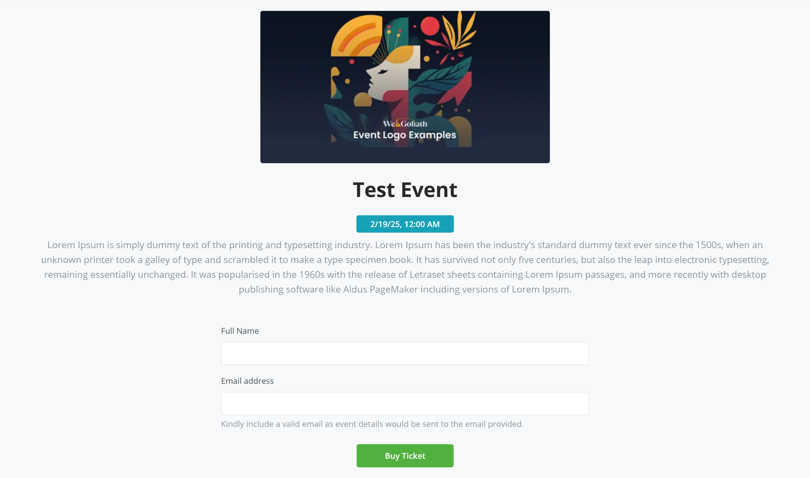
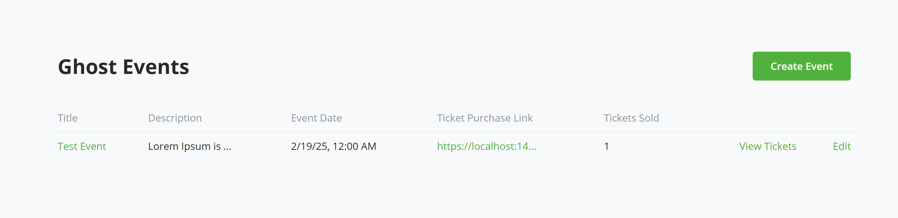
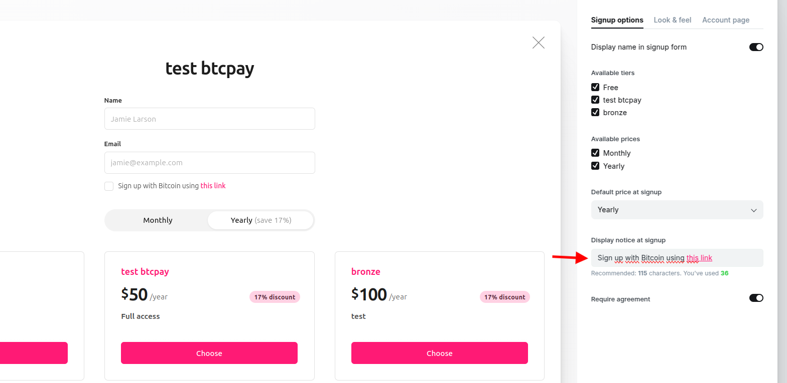
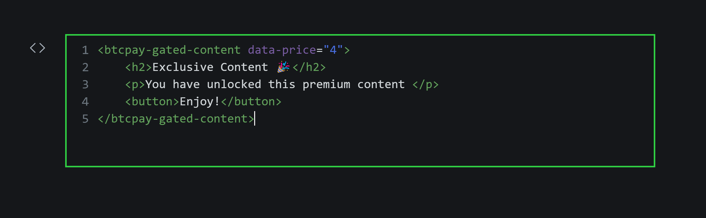

# Accept Bitcoin on Your Ghost Blog Today 

Tired of relying on Stripe for your Ghost platform and want to try something new? Do you want to receive payment from your Ghost blog in Bitcoin, of course without an 
fees and thrid party?

Introducing BTCPay Server for Ghost – a plugin that allows you accept bitcoin payments directly on your blog from customers with no fee.

Monetizing your content should be simple, and free from third-party fees. Our integration with Ghost allows you connect your self-hosted BTCPay Server with your 
[Ghost blog](https://ghost.org/), enabling you accept Bitcoin payments swiftly and securely.

With this plugin, you're not just adding a payment gateway;  you're embracing a transparent, and secure way to monetize your content which also keeps you in full control of your funds.

Whether you’re receiving donations, selling tiered memberships, or offering event tickets, this integration ensures seamless Bitcoin transactions without third-party fees.


🔹 Seamless Integration – Connect your Ghost blog to BTCPay Server in just a few clicks.

🔹 Zero Fees, Full Control – No third-party processing, just direct Bitcoin payments to your wallet.

🔹 Perfect for Creators – Monetize your blog with Bitcoin-based memberships and content access.

🔹 Event Ticketing Made Easy – Sell tickets for your events, with instant Bitcoin payments.

💡 Ready to power your blog with Bitcoin? Set up your BTCPay Server and start accepting payments


## Prerequisites:

Before diving into the setup process, ensure you have the following:

- [A Ghost account](https://ghost.org/)
- BTCPay Server - [self-hosted](Deployment.md) or run by a [third-party host](/Deployment/ThirdPartyHosting.md) v2.0.0 or later.
- [Created BTCPay Server store](CreateStore.md) with [wallet set up](WalletSetup.md)


## Setting up BTCPay Server with Ghost

1. Login to your BTCPay Server instance, Plugins > Manage Plugins

2. Search for and install BTCPay Server plugin for Ghost

3. Once installed you should see Ghost, included in the side nav, under plugins

4. Log in to your Ghost Admin Panel on a new tab

5. Navigate to Settings > Integrations. Click "Add custom integration" and name it e.g "BTCPay Server"

6. Save the integration, another screen would pop out showing the required Ghost credentials needed by the plugin.

7. Open up your BTCPay Server instance, and the Ghost plugin page.

8. Copy your API Url (without the https://), Content API key, and Admin API Key from Ghost credential page into their respective input fields in your plugin page.

9. For the username/email and password fields, enter your Ghost admin email address, and password.

10. First save your Ghost credetials on Ghost admin portal (You can input a description before saving it if you want to) and close the pop up.

11. Now save the credetial details on BTCPay Plugin. If all data is correct, it should save successfully.
	


   


   


If you got here without any hassle, congratulations on successfully installing the plugin. 

You can discontinue the plugin by clicking on the stop Ghost calls button, and also deleting the custom integration that you created.

In case you encountered any issue you can report them (Put directory to the section for opening an issue)


## 🎯 What can I do with the BTCPay-Ghost plugin?

Congratulations once again on installing your plugin successfully. Whether you’re a blogger, a business owner, or an event organizer, 

the Ghost - BTCPay Server plugin unlocks new revenue streams.

1. Accept Donations – Allow readers support your work with with donations in Bitcoin.

2. Event Ticketing - Sell tickets for virtual (workshops, consultation sessions and webinars) or in-person events using Bitcoin

3. Tiered Membership Creation and Subscriptions - Offer exclusive content to members and subscribers in a tier.

Each use case comes with an easy setup guide to help you get started quickly. Let’s dive into the details.


### Receiving Donations on Ghost through BTCPay Server

With BTCPay Server, you can accept Bitcoin donations directly on your Ghost blog — no intermediaries, no processing fees, just a seamless way for your audience to support your work.

Whether you're a blogger, journalist, or content creator, adding a Bitcoin donation option gives your supporters an easy way to contribute, while ensuring you maintain full control over your funds.


#### Steps on how to receive donations on Ghost via BTCPay Server.

1. Go to your BTCPay Server Ghost plugin, scroll down the page, you'd see donation URL, copy the URL.

2. Open your ghost admin page where you want to receive donations. You may be open to receiving donations on every content page of your Ghost blog, or on a single page dedicated to donations. Which ever you choose, 
   accepting donations is pretty straightforward. Go to the editor of your donation page (Or any page). Add a new button with a title of your choice e.g Buy me a coffee in Bitcoin, for the Bitcoin URL, paste the
   Donation URL you copied, and paste it there. Save and publish your page

3. When you go to the URL of the page, you should see the button now, click on the button, and a QR code would be displayed on the screen. Users can then scan this QR and support 
   you with any amount they want to. 
   
4. If you check your BTCPay Server invoice, you should see your new donation, received in your wallet. Voila!!!


### Event management using BTCPay Server

If you are an event organizers, conference hosts, or community managers, you can now create and manage events on your Ghost platform that accept payments on 

Bitcoin using BTCPay Server. With this you can create an event, set ticket pricing and available quantities, allow attendees purchase their tickets using Bitcoin.

Manage ticket payments e.t.c.


#### Steps on how to setup Events on Ghost via BTCPay Server.


1. Click on your BTCPay Server Ghost plugin, you'd see a dropdown of available use cases, select 'Ghost Event'.

2. Click on Create event on the top right.

3. Fill out all required event information such as title, Link (online event) or Address (Physical event), Event logo, Description, Ticket fee and currency

	Event date, number of ticket for sale (if not an unlimited ticket event), the email subject and body that would be sent to customers on purchase of every ticket.

	N.B: It is important that you have configured your email service in server settings, this is needed so that customers get all required information needed in their email.

4. Once done, click on create. This should create the event successfully, and you should see it populated in the list of events available. The admin can delete the event, or edit details regarding the event.

5. From the table, you'd see the column: Ticket purchase link, which represent the link you'd put in your event page on Ghost. Copy the link, go to your event page

	edit the ticket purchase button and replace with the url that was copied

	


6. When customers/potential attendees clicks on the link, they are redirected to a page to input their Name and Email and purchase ticket.

7. A BTCPay invoice is presented to the customer, to pay, and once paid, customer can then go ahead and download/print the invoice. 

8. If email is properly configured, the customer should get an email with details about the event as defined when creating an event. 





9. Once customers starts purchasing tickets, the admin can view all the tickets being purchased. To view, Navigate to Ghost plugin >> Ghost event list  

10. Click on 'View Tickets', it would load all the tickets that have been purchased so far. The list includes the purchaser name, email, amount, invoiceId: which is a link to details regarding the particular purchase.

11. The admin can resend ticket information for any customer that didn't get an email after purchasing ticket. The "Resend Ticket Confirmation" button would trigger this





### Membership and subscription BTCPay Server


Beyond accepting donations and managing events, if you are looking to monetize your content, community, or services with Bitcoin, this plugin also offers you

the opportunity to do so. Following the steps below, you should be able to now accept Bitcoin for membership creation and subscriptions.

Ghost doesn’t provide a direct way to integrate custom payment providers. Instead, it relies on a private API for payment processing, which is currently built around Stripe as the default processor.

Why does this matter? While BTCPay Server can handle subscriptions and send notifications to both users and admins, it cannot automatically deactivate or delete members in Ghost once a subscription ends. 

This means subscription management remains the admin’s responsibility. However, you can configure the Ghost plugin to send automated notifications to both the admin and the customer when a subscription is nearing expiration, allowing for timely action.


#### Setting up membership subscription via BTCPay Server


1. Head to your BTCPay Server Ghost plugin, scroll down on the page, Copy the 'Membership subscription Url'.

2. Head over to your Ghost admin portal, click on Settings >> Portal Settings, click on the 'Customize' button.

3. Edit the content at 'Display notice at signup' and to include instructions on how to signup if the want Bitcoin, directing users to use the link. For instance: "Sign up with Bitcoin using this link: {membership url}"

4. Save the changes and the close to the portal. You can navigate to the signup page to view your changes.





5. Before we proceed to testing it out, we need to configure webhooks for our integrations, these webhook would alert the plugin for when member's data are updated or deleted. 

6. Go to your plugin view in BTCPay Server, and copy the 'Webhook Url'

7. In your Ghost admin portal, navigate to Settings >>> Integrations. Select the custom integration you earlier created.

8. Click on 'Add webhook'. Enter a name for the webhook, for the event, select 'Member Updated', paste the URL copied into the 'Target Url' field and click on Add.

9. Create another webhook, this time the event would be 'Member Deleted'. Use the same Url for the target Url and click on Add also.

10. Once you can confirm that both your webhooks has been populated, click on 'Save' and close the modal.


11. Users can then proceed to create membership and pay vis BTCPay Server. 

12. The user is promted to enter their name and email, and also prompted to select their tier to which they need to subscribe to.

13. Once he is done filling his details, he then clicks on subscribe which would show an invoice containing his first payment to subscribe to being a member.

14. Once the invoice has been paid, a member account is created by the user on the Ghost platform, the user can then proceed to login.


15. The admin can view all subscribed members by heading over to the Ghost plugin >> Ghost members.

16. The admin can see all members, members with active subscription, members whose subscription would soon expire, and members whose subscription has expired

17. A member subscription is tagged as 'soon to expire' when the subscription ends a few days away from the end date. The days specification can be configured in the Settings.

18. Once a member subscription is about to expire, there is a green notification that appears on the Ghost plugin side nav. This is here to notify the admin. 

	The admin can proceed to notify the members, before the member's subscription expires.

19. The admin can also view all payments a particular member has done with regards to the member's subscription


20. As earlier mentioned, an admin can configure settings for his Ghost plugin

21. The admin can enable or disable automated email reminders for expiring and expired subscriptions. This would require the admin to have configured email SMTP in admin settings.

22. The admin can also set the time frame to begin notification for member subscription.


Congratulations, you have completed the setup.


### Payment Paywall on Ghost

With BTCPay Server - Ghost plugin, you can now hide premium content on your blog post until the user makes a successful payment. This guide explains how to implement a Bitcoin paywall using BTCPay Server. 

1. Go to your BTCPay Server Ghost plugin, scroll down the page, copy the paywall script url as shown in the image below.

2. Head over to your Ghost admin portal, Settings > Code Injection > Add custom code, click on the open buton.

3. Under the site header paste the script url, save and close the modal.


Now that you have the script injected, head over to the post/page editor where you want to include your paywall.

Click on the plus icon to add an item, select HTML, and in the input field paste the following code


```
    <div id = "paywall-config" data-price="100"></div>

    <div id = "paywall-content" style="display: none;">
        <h2>Premium Content</h2>
        <p>This content is only available after payment.</p>
    </div>

    <div id = "paywall-overlay">
        <button id= "payButton"> Pay with Bitcoin to unlock content</button>
    </div>

```

These are HTML tags. For customization you can replace the button tag text with whatever you want the button text to be i.e replace `Pay with Bitcoin to unlock content` with `Any text you choose`


You can also replace the h2 tag with any header/description text that you want to give to your premium item i.e replace `Premium Content` with `Any description/header of choice`


Replace the p tag with the actual premium item which can be a link to download a book, or a text or anything at all i.e replace `This content is only available after payment.` with `My hidden item`


Finally replace the data-price value from 100 to whatever amount you want to sell your content for i.e replace the 100 in `data-price="100"` with any amount.


P.S The currency associated with the amount is the same as the currency of your BTCPay Server store

P.S Do not change the Id of the tags i.e `paywall-config`, `paywall-content`, `paywall-overlay`.


If you are a technical person and good with styling and customization, further customization can be done to the elements. 





Once done, save your page/post, open the url to the post and proceed to make a payment. 


One final note, this content would be available to the user, while his browser data is still on, and would stop being once the data is cleared. It would be good to inform users to save the content once revealed.


## Contribute

BTCPay is built and maintained entirely by contributors around the internet. We welcome and appreciate new contributions.

Do you notice any errors or bug? are you having issues with using the plugin? would you like to request a feature? or are you generally looking to support the project and plugin  please [create an issue](https://github.com/TChukwuleta/BTCPayServerPlugins/issues/new)


Feel free to join our support channel over at [https://chat.btcpayserver.org/](https://chat.btcpayserver.org/) or [https://t.me/btcpayserver](https://t.me/btcpayserver) if you need help or have any further questions.
