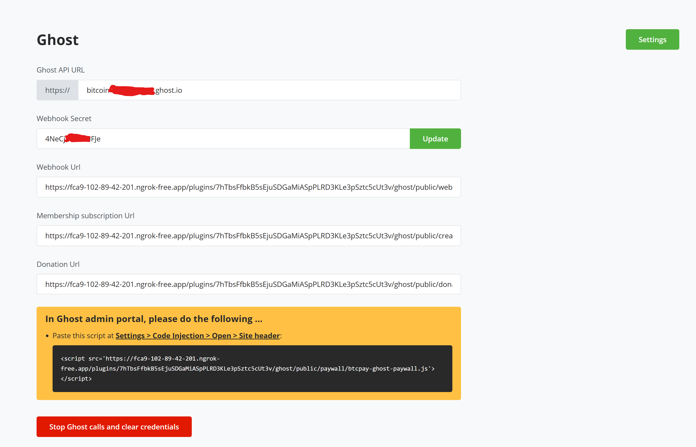

# Accept Bitcoin on Your Ghost Blog Today 

Tired of relying on Stripe for your Ghost platform and want to try something new? Do you want to receive payment from your Ghost blog in Bitcoin, of course without an 
fees and thrid party?

Introducing BTCPay Server for Ghost – a plugin that allows you accept bitcoin payments directly on your blog from customers with no fee.

Our integration with Ghost allows you connect your self-hosted BTCPay Server with your [Ghost blog](https://ghost.org/), enabling you accept Bitcoin payments swiftly and securely.

With this plugin, you're not just adding a payment gateway;  you're embracing a transparent, and secure way to monetize your content which also keeps you in full control of your funds.

Whether you’re receiving donations, selling tiered memberships, or offering event tickets, this integration ensures seamless Bitcoin transactions without third-party fees.

🔹 Seamless Integration – Connect your Ghost blog to BTCPay Server in just a few clicks.

🔹 Zero Fees, Full Control – No third-party processing, just direct Bitcoin payments to your wallet.

🔹 Perfect for Creators – Monetize your blog with Bitcoin-based memberships and content access.

🔹 Event Ticketing Made Easy – Sell tickets for your events, with instant Bitcoin payments.

💡 Ready to power your blog with Bitcoin? Set up your BTCPay Server and start accepting payments

## Prerequisites:

Before diving into the setup process, ensure you have the following:

- [A Ghost account](https://ghost.org/)
- BTCPay Server - [self-hosted](Deployment.md) or run by a [third-party host](/Deployment/ThirdPartyHosting.md) v2.0.0 or later.
- [Created BTCPay Server store](CreateStore.md) with [wallet set up](WalletSetup.md)

## Setting up BTCPay Server with Ghost

### Installation guide for your BTCPay Server - Ghost plugin
1. Login to your BTCPay Server instance, Plugins > Manage Plugins
2. Search for and install BTCPay Server plugin for Ghost
3. Once installed you should see Ghost, included in the side nav, under plugins
4. Log in to your Ghost Admin Panel on a new tab
5. Navigate to Settings > Integrations. Click "Add custom integration" and name it e.g "BTCPay Server"
6. Save the integration, another screen would pop out showing the required Ghost credentials needed by the plugin.
7. Open up your BTCPay Server instance, and the Ghost plugin page.
8. Copy your API Url (without the https://), Content API key, and Admin API Key from Ghost credential page into their respective input fields in your plugin page.
9. For the username/email and password fields, enter your Ghost admin email address, and password.
10. First save your Ghost credetials on Ghost admin portal (You can input a description before saving it if you want to) and close the pop up.
11. Now save the credetial details on BTCPay Plugin. If all data is correct, it should save successfully.

   

   

Use Cases:
Membership Payments:
Allow Ghost users to pay for memberships via Bitcoin using BTCPay Server.
Automatically update the membership status in Ghost once payment is confirmed.
Subscription Renewals:
Automate Bitcoin payments for recurring memberships (handled manually since BTCPay doesn’t natively support subscriptions... until subscription plugin is complete).

Integrating BTCPay Server with Ghost Commerce to accept Bitcoin payments provides a variety of use cases, depending on your goals and the type of e-commerce or content-based transactions you're running. Here are some key use cases:

1. Subscription Payments for Premium Content
If you're offering premium content or memberships on your Ghost site (like articles, tutorials, or videos), you can allow users to pay for subscriptions using Bitcoin. This is especially appealing to users who prefer decentralized and censorship-resistant payment methods.
2. One-Time Purchases
Enable one-time payments for digital products, merchandise, or services through Ghost's commerce platform using Bitcoin. For instance, eBooks, online courses, or physical items.
3. Donations or Crowdfunding
Set up a seamless way to accept donations in Bitcoin for specific campaigns or ongoing funding. This can be particularly useful for creators, nonprofits, or activists.

## Receiving Donations on Ghost through BTCPay Server
Together with the ability to  fiat donations on your Ghost website, with BTCPay Server, you can now also receive donations in Bitcoin.
Follow the guide to get started.

### Steps on how to receive donations on Ghost via BTCPay Server.
1. Go to the editor of your donation page. (You can create a new page for Donation on your admin panel if you do not have one.), Add a button, with a Title of your choice e.g Donate Bitcoin. 
1. In Shopify, click on `Apps >` in the left sidebar   

2. On the modal popped up, click on `App and sales channel settings`   

3. From the page displayed, click on `Develop apps` button   

4. If prompted, click on `Allow custom app development`   
 
5. `Create an app` and name it, e.g. BTCPay Server, click on `Create App`      

6. On the app page, in `Overview` tab, click on the `Configure Admin API scopes`   

7. In the filter admin access scopes type in `Orders`
8. In `Orders` enable `read_orders` and `write_orders` and then click `Save`     
   
9. Click on the "API credentials" tab, and then click on the `Install App` in the top right corner and when pop-up window appears click `Install`   
   
   
10. Reveal `Admin API access token` and `copy` it (and note it down somewhere safe)   
11. Also copy the `API key` and `API Secret` and note it down somewhere safe     
   
12. Shopify app setup is now complete