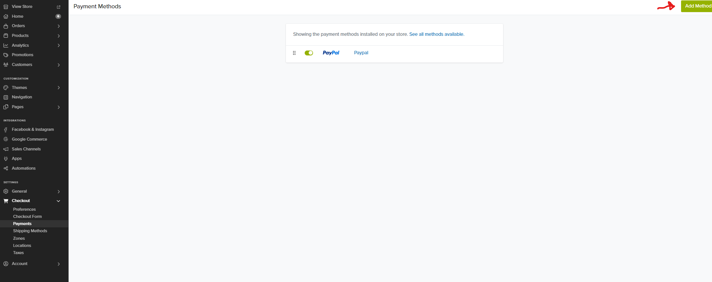
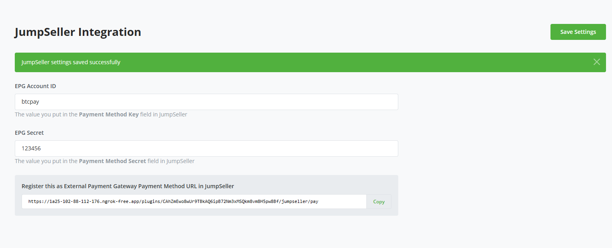
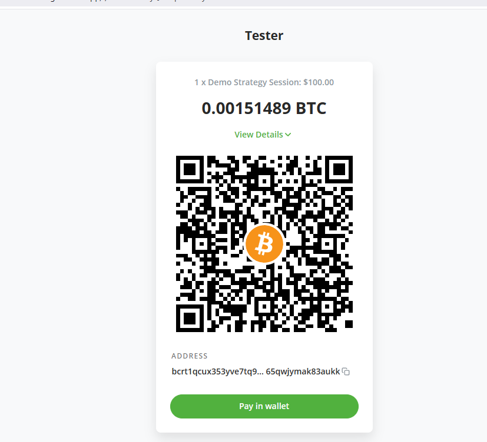
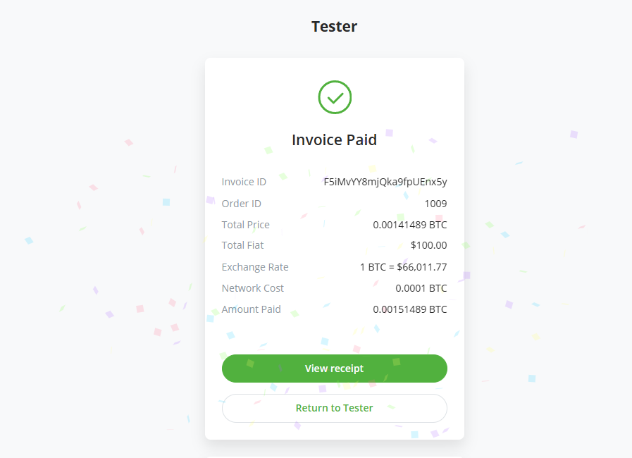
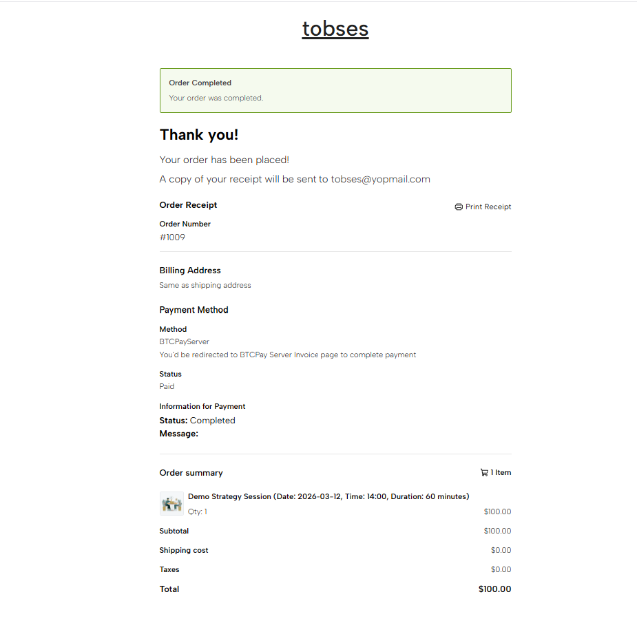

# BTCPay Server - Jump Seller Plugin

Accept Bitcoin and Lightning Network payments directly in your JumpSeller store. 

## What you need?

- A running BTCPay Server instance (self-hosted or hosted by a third party)
- A JumpSeller store on any paid plan

## Installation

1. On the left navigation of BTCPay Server UI click **Manage Plugins** search for **JumpSeller** plugin
2. Install the plugin, and if BTCPay Server requests that you restart the instance, go ahead and restart.
3. Once the plugin is installed, you should see `JumpSeller` in the left navigation. Click on it to open the settings page.
4. On a new tab, log into your JumpSeller admin panel.
5. Go to Settings → Checkout → Payments. On the top right of the page , click on `Add Payment Method` button
6. You'd see a list of Methods to select from. Choose `External Gateway`.
7. Fill in the details of the payment method as follows:
   - Name: `BTCPay Server` (or any name you want to give to the payment method)
   - Description: `Pay with Bitcoin and Lightning Network`
	- Logo: BTCPay Server logo
	- Payment Method URL: This is the gateway url and it is available in the plugin settings page.
	- Payment Method Key: This can be any value, for example `btcpayserver`. The value chosen should also be added in the plugin settings page for XXXX input field.
	- Payment Method Secret: This can be any value, for example `btcpayserver`. The value chosen should also be added in the plugin settings page for YYYY input field.
8. Click `Save` to save the payment method. You should see the new payment method in the list of payment methods. Also save settings in the plugin page after adding the payment method in JumpSeller.

That's it. Now you can now receive Bitcoin and Lightning Network payments in your JumpSeller store.

## Contribute

This BTCPay Server plugin is built and maintained entirely by contributors around the internet. We welcome and appreciate new contributions.

Do you notice any errors or bug? are you having issues with using the plugin? would you like to request a feature? or are you generally looking to support the project and plugin please [create an issue](https://github.com/TChukwuleta/BTCPayServerPlugins/issues/new)

Feel free to join our support channel over at [https://chat.btcpayserver.org/](https://chat.btcpayserver.org/) or [https://t.me/btcpayserver](https://t.me/btcpayserver) if you need help or have any further questions.

