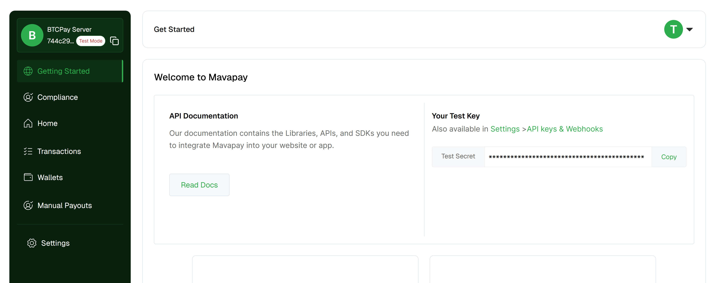
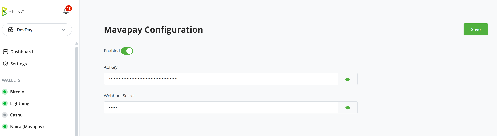
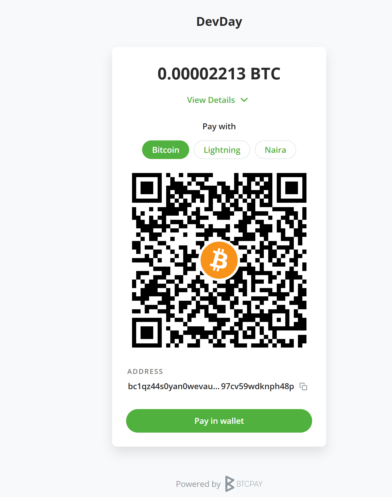
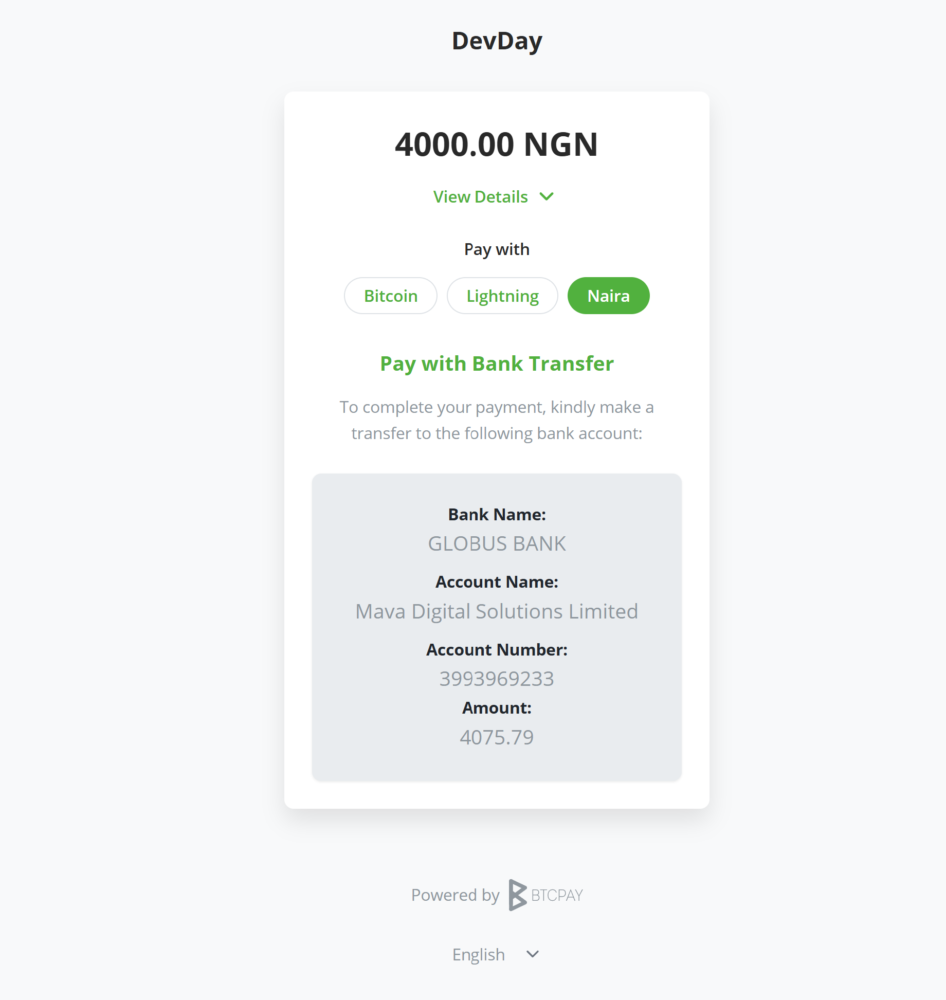

# Accept Bitcoin Payments in Naira

Introducing BTCPay Server - Mavapay checkout plugin - a simple way to accept Bitcoin payments from Nigerian customers. 
Expand your customer base by accepting Bitcoin payments from Nigerians by simply allowing them to pay in Naira while you receive Bitcoin. 

## Prerequisites:

Before diving into the setup process, ensure you have the following:

- [A Mavapay account](https://mavapay.co/)
- BTCPay Server - [self-hosted](Deployment.md) or run by a [third-party host](/Deployment/ThirdPartyHosting.md) v2.0.7 or later.
- [Created BTCPay Server store](CreateStore.md) with [wallet set up](WalletSetup.md)

## Setting up BTCPay Server with Mavapay

1. Login to your BTCPay Server instance, Plugins > Manage Plugins

2. Search for and install the plugin `Naira Checkout - Mavapay`

3. Once installed you should see `Naira (Mavapay)`, included in the side nav of your instance in the wallets section

4. Log in to your Mavapay account on a new tab, on the dashboard, you'd see your Secret. Copy the key.

5. Head back to your BTCPay Server instance, click on `Naira (Mavapay)` in the side nav, and paste the key into the `Mavapay API Key` input field.

6. It is also required that you enter a secret key, which would stand in as your webhook secret. You can enter a secret of your choice.

7. Once both fields are filled, click on the `Save` button to save your credentials. Viola! You are now ready to accept Bitcoin payments in Naira.

Go ahead and create an invoice, you can do this by clicking on the `Create Invoice` button in the top right corner of your BTCPay Server instance.

On checkout, together with the existing payment options, you should see the option to pay with Naira.

Select the Naira option, and then an account number and Bank would be displayed together with the amount for you to make a transfer to. 

At this point open your bank app, and make a transfer to the account number displayed. Please ensure the amount is the same as the one displayed on the invoice.

Once the transaction is successful, in a matter of seconds, the invoice would be paid, just as if you had paid with Bitcoin directly.

## Contribute

BTCPay Server is built and maintained entirely by contributors around the internet. We welcome and appreciate new contributions.

Do you notice any errors or bug? are you having issues with using the plugin? would you like to request a feature? or are you generally looking to support the project and plugin please [create an issue](https://github.com/TChukwuleta/BTCPayServerPlugins/issues/new)

Feel free to join our support channel over at [https://chat.btcpayserver.org/](https://chat.btcpayserver.org/) or [https://t.me/btcpayserver](https://t.me/btcpayserver) if you need help or have any further questions.
