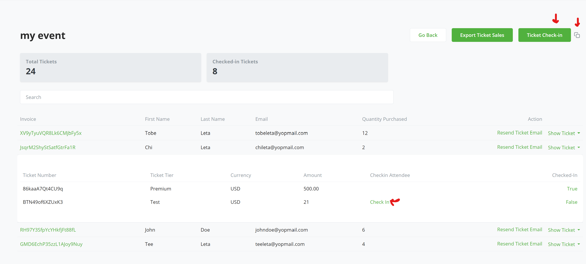

# Satoshi Tickets 

## Event Ticketing and Management System using Bitcoin via BTCPay Server

### Introduction

The Satoshi Tickets plugin enables users to sell tickets using Bitcoin payments via BTCPay Server. 

If you are an event organizer, conference host, or community managers, you can now create and manage events on your BTCPay Server instance that accept payments via Bitcoin using BTCPay Server. 

### Features

**Bitcoin Payments:** Accept Bitcoin payments securely via BTCPay Server.

**Event Creation & Management:** Organizers can create and manage events, ticket tiers, and pricing.

Automated QR Code Generation: Each ticket is linked to a unique QR code for seamless verification.

**Order & Transaction Management:** Track ticket purchases and payment confirmations.

**Decentralized and Self-Hosted:** Uses BTCPay Server, eliminating the need for third-party payment processors.

**Email Notifications:** Buyers receive confirmation emails with their QR-coded tickets.

**Ticket Scanner:** For physical events, events managers can now scan events to grant entry to attendee

## Prerequisites:

Before diving into the setup process, ensure you have the following:

- BTCPay Server - [self-hosted](Deployment.md) or run by a [third-party host](/Deployment/ThirdPartyHosting.md) v2.0.0 or later.
- [Created BTCPay Server store](CreateStore.md) with [wallet set up](WalletSetup.md).
- Configured Email in Store settings (for sending email notifications).

## Usage Guide

### Installation and configuration

1. Go to your BTCPay Server >> Manage plugins. Find and install "Satoshi Tickets" plugin.

2. Once installed, navigate to the plugin page and click on the "Satoshi Tickets" plugin.

3. First thing is to make sure you have set the Email/SMTP for your store, if not you will see a notification at the top. Follow the link which will bring you to your store Settings >> Email Settings. Fill in the necessary details and save.

### Create an event

1. Click on 'Create Event' button to create a new event. Fill necessary details about the event including the email content that would be sent on purchase. You can upload a logo or image for the event.
   
   

2. Once created successfully, you'd be redirected to a page where you would need to configure ticket tiers which would include tier name, ticket price, quantity (number of available tickets for this ticket tier).
      
   

3. You can configure as many ticket tiers/levels as you want.
   

4. Navigate to the events list page. Activate the event. (Otherwise the event link will return a 404 error)
   

6. You can now share the event link (see column "Ticket Purchase link") with your audience, or put it up in websites, newsletters, chats or anywhere else.

### Purchasing tickets
1. On the ticket page, users can see the event information. 
   
   

2. After clicking on "Get a Ticket", the user can choose between the configured ticket tiers and enter the desired quantity. The summary will show the total payment amount.
   
3. After clicking on "Continue", the user is then requested to enter their name and email. This allows users to receive tickets via email and also to track their ticket purchase.
   
4. After clicking on "Complete payment" the BTCPay checkout page will be shown. The user can choose between the available payment methods (on-chain, Lightning, etc.) and pay the ticket price.
   
5. After the payment is confirmed, the user will see the confirmation page and can print a receipt. At the same time the email notification with the link to the tickets will be sent to the user. 
   

Congratulations, everything is set up and ticket purchasing is working.

### Checking-in and validating tickets
1. After the user has paid, they will receive an email with a link to download their ticket. The ticket contains a QR code that can be scanned at the event entrance.
   

2. The event organizer can use the admin panel check in event attendees by clicking on "tickets" in the event overview.
      

3. In the ticket list, tickets can be searched by the ticket ID, name or email. By clicking on "Check-in"
      

      

      

## Contribute

This BTCPay Server plugin is built and maintained entirely by contributors around the internet. We welcome and appreciate new contributions.

Do you notice any errors or bug? are you having issues with using the plugin? would you like to request a feature? or are you generally looking to support the project and plugin please [create an issue](https://github.com/TChukwuleta/BTCPayServerPlugins/issues/new)

Feel free to join our support channel over at [https://chat.btcpayserver.org/](https://chat.btcpayserver.org/) or [https://t.me/btcpayserver](https://t.me/btcpayserver) if you need help or have any further questions.