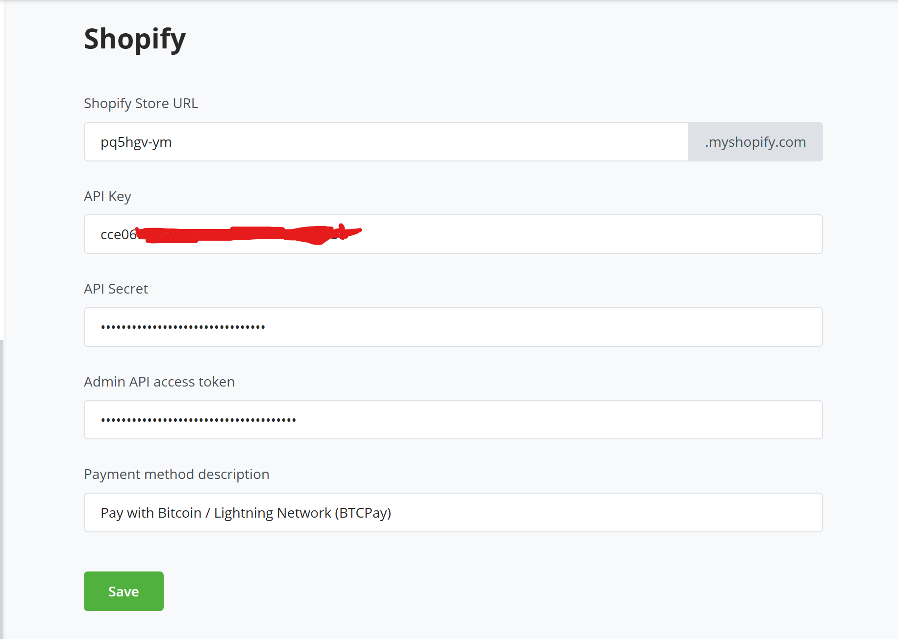
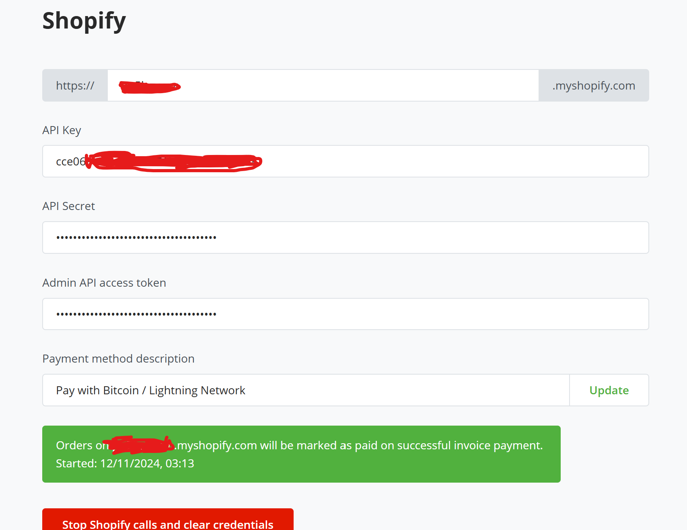

# Accept Bitcoin in Shopify with BTCPay Server

Introducing BTCPay Server for Shopify – open-source payment gateway that enables you accept bitcoin payments directly on your website or stores from customers with no fee.

Our integration with Shopify allows you connect your self-hosted BTCPay Server with your [Shopify store](https://www.shopify.com/), enabling you accept Bitcoin payments swiftly and securely.

## What BTCPay offers:

- **Zero fees**: Enjoy a payment gateway with no fees. Yes, You saw that right. Zero fees!
- **Direct payment, No middlemen or KYC**: Say goodbye to intermediaries and tedious paperwork, and get your money directly in your wallet
- **Fully automated system**: BTCPay takes care of payments, invoice management and refunds automatically.
- **Display Bitcoin QR code at checkout**: Enhance customer experience with an easy and secure payment option.
- **Self-hosted infrastructure**: Maintain full control over your payment gateway.
- **Lightning Network integrated**: Instant, fast and low cost payments and payouts
- **Easy CSV exports**
- **Versatile plugin system**: Extend functionality according to your needs
- **Point-of-sale integration** – Accept payments in your physical shops
- **Multilingual ready**: Serve a global audience right out of the box.
- **Community-driven support**: Get responsive assistance from our dedicated community ([Mattermost](http://chat.btcpayserver.org/) or [Telegram](https://t.me/btcpayserver)).

## Prerequisites:

Before diving into the setup process, ensure you have the following:

- Shopify account
- BTCPay Server - [self-hosted](Deployment.md) or run by a [third-party host](/Deployment/ThirdPartyHosting.md) v2.0.0 or later.
- [Created BTCPay Server store](CreateStore.md) with [wallet set up](WalletSetup.md)

:::warning
Shopify might give false flags on deprecated API calls. The most likely answer we could find, due to a change by Shopify to specific fields of the `Order` resource and is assumed to get used in BTCPay Server. Find more details [here](https://github.com/btcpayserver/btcpayserver/issues/4510)
:::

## Setting up BTCPay Server with Shopify

1. In Shopify, click on `Apps >` in the left sidebar
2. On the modal popped up, click on `App and sales channel settings`
3. From the page displayed, click on `Develop apps` button
4. If prompted, click on `Allow custom app development`
5. `Create an app` and name it, e.g. BTCPay Server
6. On the app page, in `Overview` tab, click on the `Configure Admin API scopes`
7. In the filter admin access scopes type in `Orders`
8. In `Orders` enable `read_orders` and `write_orders` and then click `Save`
9. Click on the API credential tab, and then click on the `Install App` in the top right corner and when pop-up window appears click `Install`
10. Reveal `Admin API access token` and `copy` it

11. In your BTCPay Server, go to your plugins, find and install Shopify plugin. Once done, on the left sidebar click on `Shopify`
12. In the first field, `Shop name` enter the subdomain of your Shopify store e.g. SOME_ID.myshopify.com then enter SOME_ID
13. In the last field, `Admin API access token` paste the `Admin API access token` you just copied from Shopify
14. In the second field, `API key` paste the `API key` from Shopify - which you can find at the bottom of the same page where you copied the Admin API access token. Do the same for the third field, paste the `API Secret` from Shopify and paste in the `API Secret` filed
15. You can decide to edit the payment method description text. This basically defines the text that the user sees when the invoice loads on shopify.
16. Click `Save` on BTCPay Shopify settings page 
17. BTCPay then validates the credentials, and once validated, creates an create order webhook, and finally saves the credentials.
18. Back to Shopify, on the home page, click on `Settings` >> `Payments` in the left sidebar, scroll down to "Manual payment methods", click on `(+) Manual payment method` and select `Create custom payment method` on the dropdown.
19. In `Custom payment method name` fill in `Bitcoin with BTCPay Server`, optionally you can fill in other fields, but it's not required.
	However you would need to inform your customers that payment with Bitcoin comes on the next screen (Thank you) after checkout, so you would need to inform them in the `Additional details` of the `Manual payment method`.
	The payment option can have a delay between 2 - 10 seconds on the Thank you page, before it is displayed so this also needs to be communicated with the customers.
    	
20. Hit `Activate` and you've set up Shopify and BTCPay Server payment method successfully.

:::tip
"Custom Payment method name" **must** contain at least one of the following words (case-insensitive): `bitcoin`, `btcpayserver`, `btcpay server` or `btc` to work.
:::

### Install BTCPay-Shopify application on Shopify

The second piece of this installation guide is setting up the BTCPay-Shopify application. You can decided to host your own btcpay-shopify application 
or use the application supported by the team.

#### Using BTCPay-shopify hosted application

1. Now we need to install the BTCPay - Shopify app. Visit the [Shopify app store](https://apps.shopify.com/) search for and install the BTCPay Server plugin application
2. Once installed, you can go to your dashboard, click on `Apps >` in the left sidebar, then you would see the list of installed application, including the just installed BTCPay plugin app. 
3. Select the BTCPay app, and in the view input your BTCPay Server domain url (e.g btcpay.example.com) and the storeId to which your shopify plugin is connected on the BTCPay instance

4. In your shopify dashboard, click on `Settings`, whch is located on the bottom of the left nav panel, select `Checkout` and then `Customize`
5. In the editor change the selected page to the Thank you page

6. Click on the `Apps` icon on the left panel > `Add app block` on the bottom of the section tab
7. Click on `Sections` icon on the left panel > `Order details` > `Add app block` on the bottom of the section tab
8. Select the BTCPay Server extensions.
9. Click `Save` button on the top right corner of the page to save the changes

#### Self hosting the BTCPay-shopify application

If you are a developer or would love to have your own instance, you would need to create and deploy your own application.
##### Prerequisite:
 1. Database (postgresql)
 2. Cloud/Server instance to deploy your shopify application
 3. Shopify plugin installed in your BTCPay instance

##### Guidelines 
1. To begin, create a [shopify partner account](https://www.shopify.com/partners)
2. Click on `Apps` > `All Apps` > `Create App` > `Create app manually`. Enter the name you want to call the application and click `Create`.
3. Once created it would take you to a screen displaying your client Id and secret.
4. Next, you would need to clone or download this [repository](https://github.com/TChukwuleta/btcpayshopifyplugin)
5. Once you have the repository cloned, install the dependencies. Open your command prompt and enter the command `npm install`
6. In your application, you have an extension which can be found in the `extensions` folder.
7. Create a .env file. Paste the following variables.
	1. SHOPIFY_API_KEY => Represents the Client ID associated with the shopify app created
	2. SHOPIFY_API_SECRET => Represents the Client Secret associated with the shopify app
	3. DATABASE_URL = Your database connection string
	
Please note, if you want to use a different database other than postgres, navigate to `prisma` > `schema.prisma`, change the provider from postgresql to your database of choice.

8. In your `shopify.app.toml` file, the following changes would also be needed:
	Change the value of `client_id` to your shopify Client Id. (Same value as SHOPIFY_API_KEY) 
	Change `name` and `handle` to the name of your shopify application during creation on your partner dashboard. Both names must be the same
	You can also change the name of your extensions. Go to `extensions` > `shopify.extension.toml` and change `name` and `handle` to your desired name for extensions. Both names must be the same
9. You can test your application by running the command `npm run dev` which would load a dev instance of the shopify application. 
10. Once done deploy your application to shopify. Run the command `npm run deploy`. Once deployed go back to your shopify partner application select the application
    click on `Release` > `Versions`, you should see a new version with the same timestamp as to when you deployed. 
11. At the same time, if you open your .env file, you would see a new variable generated: `SHOPIFY_{EXTENSION_NAME}_ID`

12. At this point you'd need to deploy your application to your cloud or server instance. The following are required enviroment variables that needs to be set on your server.

	1. SHOPIFY_API_KEY => Represents the Client ID associated with the shopify app
	2. SHOPIFY_API_SECRET => Represents the Client Secret associated with the shopify app
	3. DATABASE_URL = Your database connection string
	4. SHOPIFY_{EXTENSION_NAME}_ID => the Id generated in .env by shopify on deploy

13. Congratulation on deploying your application. Let's get back to our configuration. Now unto the extension bit, navigate to `extensions > {extension name} > src > Checkout.jsx`, there is a variable called `shopifyApplicaitonUrl`, replace the value with your deployed URL.
14. In your shopify.app.toml file, change the value `application_url` to your deployed URL; change the base url in all `redirect_urls` to your deployed URL
15. To your server environment variables, add SHOPIFY_APP_URL => your deployed URL
16. Re-deploy your code changes to your server and also to shopify using the command `npm run deploy`.
17. Head back to your application dashboard on your partner account. Select configuration. Confirm that the App Url and the redirection Url match your deployed URL.
18. Select `API Access` on the navigation panel. Scroll down to `Allow network access in checkout and account UI extensions` and ensure it is enabled.

Congratulations on getting here, if all goes well, your deployed URL should a similar image as below:  You can decide to customize the view to suit business needs

Now it is time to deploy your application to the Shopify store that you are linking to BTCPay server. On your application dashboard, select distribution >> Custom distribution
Please note that selecting custom distribution would mean that you can only use the application on only one shopify store. This is irreversible.

On the next screen enter the Shopify store url that you want to link the application to.

Open the link generated on a new tab. Select the store to install the app on (ensure it matches with the store you inputted). Go ahead and install the application. 

CONGRATULATION!!!!... You made it. 

Go back to `Using BTCPay-shopify hosted application` section of this docs and continue from step 2 - 8.

## Demo Checkout flow after everything is set up:

Feel free to join our support channel over at [Mattermost](https://chat.btcpayserver.org/) or [Telegram](https://t.me/btcpayserver) if you need help or have any further questions.
