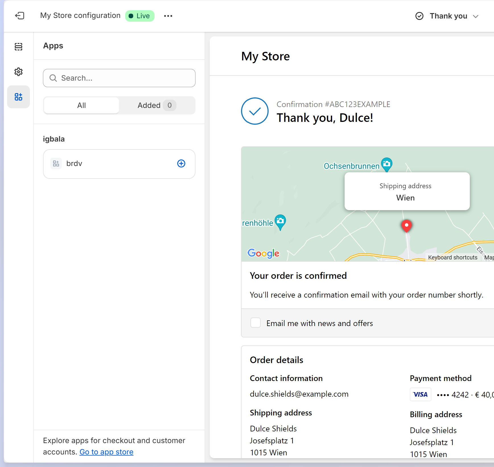
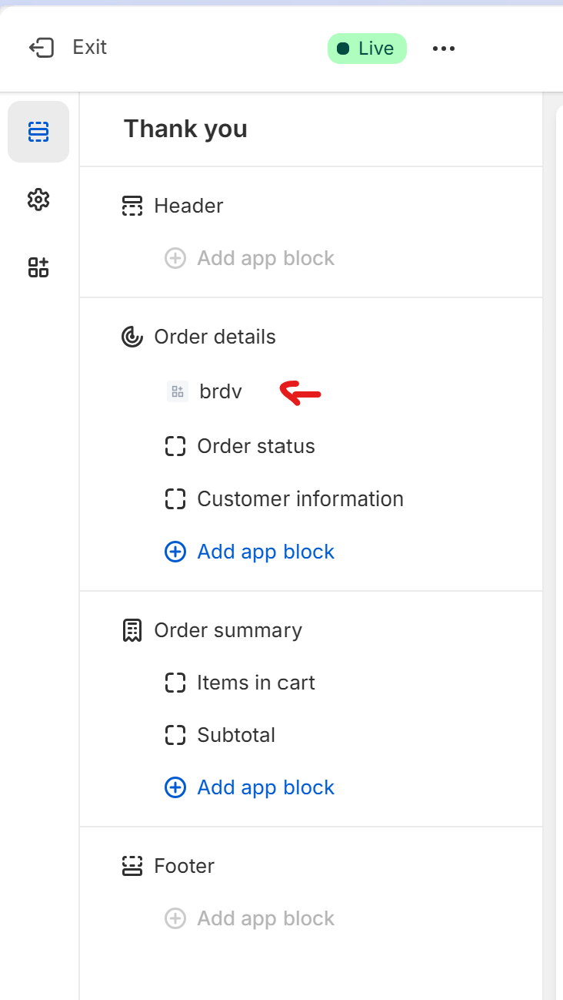
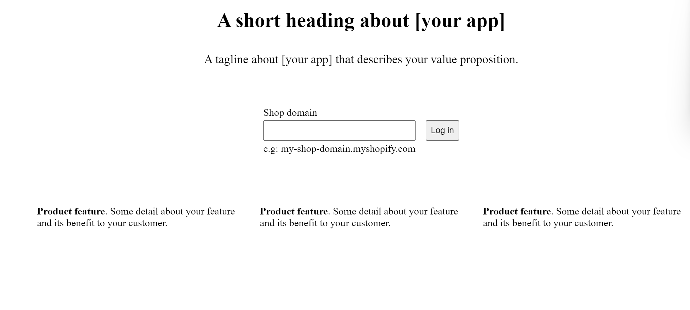

# Accept Bitcoin in Shopify with BTCPay Server

Introducing BTCPay Server for Shopify – open-source payment gateway that enables you accept bitcoin payments directly on your website or stores from customers with no fee.

Our integration with Shopify allows you connect your self-hosted BTCPay Server with your [Shopify store](https://www.shopify.com/), enabling you accept Bitcoin payments swiftly and securely.


## What BTCPay offers:

- **Zero fees**: Enjoy a payment gateway with no fees. Yes, You saw that right. Zero fees!
- **Direct payment, No middlemen or KYC**: Say goodbye to intermediaries and tedious paperwork, and get your money directly in your wallet
- **Fully automated system**: BTCPay takes care of payments, invoice management and refunds automatically.
- **Display Bitcoin QR code at checkout**: Enhance customer experience with an easy and secure payment option.
- **Self-hosted infrastructure**: Maintain full control over your payment gateway.
- **Lightning Network integrated**: Instant, fast and low cost payments and payouts
- **Easy CSV exports**
- **Versatile plugin system**: Extend functionality according to your needs
- **Point-of-sale integration** – Accept payments in your physical shops
- **Multilingual ready**: Serve a global audience right out of the box.
- **Community-driven support**: Get responsive assistance from our dedicated community ([Mattermost](http://chat.btcpayserver.org/) or [Telegram](https://t.me/btcpayserver)).


## Prerequisites:

Before diving into the setup process, ensure you have the following:

- Shopify account
- BTCPay Server - [self-hosted](Deployment.md) or run by a [third-party host](/Deployment/ThirdPartyHosting.md) v2.0.0 or later.
- [Created BTCPay Server store](CreateStore.md) with [wallet set up](WalletSetup.md)

[](https://www.youtube.com/watch?v=jJjAyvgWVfk)

:::warning
Shopify might give false flags on deprecated API calls. The most likely answer we could find, due to a change by Shopify to specific fields of the `Order` resource and is assumed to get used in BTCPay Server. Find more details [here](https://github.com/btcpayserver/btcpayserver/issues/4510)
:::

## Setting up BTCPay Server with Shopify

### Create an app and get API credentials from Shopify
1. In Shopify, click on `Apps >` in the left sidebar   

2. On the modal popped up, click on `App and sales channel settings`   

3. From the page displayed, click on `Develop apps` button   

4. If prompted, click on `Allow custom app development`   
 
5. `Create an app` and name it, e.g. BTCPay Server, click on `Create App`      


6. On the app page, in `Overview` tab, click on the `Configure Admin API scopes`   

7. In the filter admin access scopes type in `Orders`
8. In `Orders` enable `read_orders` and `write_orders` and then click `Save`     
   
9. Click on the "API credentials" tab, and then click on the `Install App` in the top right corner and when pop-up window appears click `Install`   
   
   
10. Reveal `Admin API access token` and `copy` it (and note it down somewhere safe)   
11. Also copy the `API key` and `API Secret` and note it down somewhere safe     
   
12. Shopify app setup is now complete

### Set up a custom payment method in Shopify
1. Back to Shopify, on the home page, click on `Settings` >> `Payments` in the left sidebar, scroll down to "Manual payment methods", click on `(+) Manual payment method` and select `Create custom payment method` on the dropdown.
   
2. In `Custom payment method name` fill in `Bitcoin with BTCPay Server` (also see TIP box below), optionally you can fill in other fields, but it's not required.
   However you would need to inform your customers that payment with Bitcoin comes on the next screen after checkout on the "Thank you" page. Ideally you would inform your customers in the `Additional details` field.
   The payment option can have a delay between 2 - 10 seconds on the "Thank you" page, before it is displayed so this also needs to be communicated with the customers. Suggested text: `Please note that the Bitcoin payment option will be displayed on the "Thank you" page after a few seconds. If it does not show up after 5-10 seconds please contact our support.`
3. Hit `Activate` and you've set up Shopify and BTCPay Server payment method successfully.
   

:::tip
"Custom Payment method name" **must** contain at least one of the following words (case-insensitive): `bitcoin`, `btcpayserver`, `btcpay server` or `btc` to work.
:::

## Install BTCPay Server Shopify plugin
1. In your BTCPay Server, go to your plugins, find and install Shopify plugin. Once done, on the left sidebar click on `Shopify`
2. In the first field, `Shopify Store URL` enter the subdomain of your Shopify store e.g. SOME_ID.myshopify.com then enter SOME_ID
3. In the second field, `API key` paste the `API key` from Shopify - see steps above.
4. Do the same for the third field, paste the `API Secret` from Shopify and paste in the `API Secret` field.
5. In the last field, `Admin API access token` paste the `Admin API access token` 
6. You can decide to edit the payment method description text. This basically defines the text that the user sees when the invoice loads on shopify.
7. Click `Save` on BTCPay Shopify settings page   

8. BTCPay then validates the credentials, and once validated, creates an create order webhook, and finally saves the credentials.   


   

## Install BTCPay-Shopify application on Shopify

The second piece of this installation guide is setting up the BTCPay-Shopify app. You can choose to self-host your own BTCPay-Shopify app 
or use the app we submitted to the Shopify App Store.

### Using BTCPay-Shopify from Shopify App Store

:::warning
As of now, the BTCPay-Shopify app is not yet available on the Shopify App Store. We are working on getting it published.
:::

1. Now we need to install the BTCPay-Shopify app. Visit the [Shopify app store](https://apps.shopify.com/) search for "BTCPay" and install the BTCPay-Shopify app.
2. Once installed, you can go to your dashboard, click on `Apps >` in the left sidebar, then you would see the list of installed apps, including the just installed BTCPay-Shopify app. 
3. Select the BTCPay-Shopify app, and in settings, input your `BTCPay Server URL` (e.g https://btcpay.example.com) and the `storeId` to which your Shopify plugin is connected on your BTCPay Server instance.


4. In your shopify dashboard, click on `Settings`, which is located on the bottom of the left nav panel, select `Checkout` and then `Customize`
5. In the editor change the selected page to the Thank you page


6. Click on the `Apps` icon on the left panel > `Add app block` on the bottom of the section tab
7. Click on `Sections` icon on the left panel > `Order details` > `Add app block` on the bottom of the section tab
8. Select the BTCPay Server extensions.
9. Click `Save` button on the top right corner of the page to save the changes







### Self-hosting the BTCPay-shopify app

If you are a developer or would love to have total control, you would need to create and deploy your own application.
#### Requirements:
1. A Linux VPS instance to deploy your shopify app to
2. The VPS should have [Docker Engine installed](https://docs.docker.com/engine/install/)
3. A domain/subdomain with an DNS A-record to the IP of your VPS instance, in our example below we use the placeholder "YOUR_HOSTED_APP_URL.COM", e.g. btcpaypp.example.com
4. Shopify plugin installed in your BTCPay Server instance
5. A [shopify partner account](https://www.shopify.com/partners)

#### Installation instructions: 

##### Create a Shopify app on partner account
1. On Shopify Partner [dashboard](https://partners.shopify.com), click on `Apps` > `All Apps` > `Create App` > `Create app manually`. Enter the name you want to call the app (e.g. BTCPay Server APPNAME) and click `Create`.
2. Once created displays your "Client ID" and "Client secret", which we need in a minute. 
3. On the left sidebar click on `Configuration`
4. In the `App URL` field, enter the URL of your hosted app, e.g. `https://YOUR_HOSTED_APP_URL.COM`
5. In the `Allowed redirection URL(s)` field, enter:
``` 
https://YOUR_HOSTED_APP_URL.COM/auth/callback
https://YOUR_HOSTED_APP_URL.COM/auth/shopify/callback
https://YOUR_HOSTED_APP_URL.COM/api/auth/callback
```
6. In the fields in the "Compliance webhooks" section, enter the following:
`Customer data request endpoint` => https://YOUR_HOSTED_APP_URL.COM/webhooks/customers/data_request
`Customer data erasure endpoint` => https://YOUR_HOSTED_APP_URL.COM/webhooks/customers/redact
`Shop data erasure endpoint` => https://YOUR_HOSTED_APP_URL.COM/webhooks/shop/redact
IMAGE
7. Click on `Save` to save the changes
8. On the left sidebar click on `API Access`
9. Scroll down to "Allow network access in checkout and account UI extensions" and click on `Request access`
IMAGE

##### Deploy the BTCPay-Shopify app 

5. Next on your VPS switch to root user and clone or download [this repository](https://github.com/btcpayserver/btcpayshopifyapp) and go into that directory
   ```bash
   git clone https://github.com/btcpayserver/btcpayshopifyapp.git
   cd btcpayshopifyapp
   ``` 

6. Copy `.env.example` to `.env` file, it contains the following environment variables:
- DATABASE_URL => Your database connection string, keep it as is if you are using the default sqlite database
- SHOPIFY_API_KEY => Represents the "Client ID" associated with the shopify app created (step 2 above)
- SHOPIFY_API_SECRET => Represents the "Client Secret" associated with the shopify app (step 2 above)
- SHOPIFY_APP_URL => Internal URL to reach your app, e.g. `http://localhost:3000`
- DOMAIN => Your app domain, e.g. YOUR_HOSTED_APP_URL.COM
- LETSENCRYPT_EMAIL => Your email address for Let's Encrypt

```dotenv
DATABASE_URL=file:/app/data/database.sqlite
SHOPIFY_APP_URL=http://localhost:3000
SHOPIFY_API_KEY=your_client_id
SHOPIFY_API_SECRET=your_client_secret
DOMAIN=YOUR_HOSTED_APP_URL.COM
LETSENCRYPT_EMAIL=johndoe@example.com
```
Replace the values of `SHOPIFY_API_KEY`, `SHOPIFY_API_SECRET`, DOMAIN and `LETSENCRYPT_EMAIL` with your values. Don't change the value of `DATABASE_URL` and `SHOPIFY_APP_URL`.

7. Now you need to adjust the app config file. Rename `shopify.app.toml.example` to `shopify.app.toml` and change the following values:
	Change the value of `client_id` to your apps Client ID. (Same value as SHOPIFY_API_KEY) 
	Change `name` and `handle` to the name of your app (created in step 1. above) e.g. `name = "BTCPay Server"` and `handle = "btcpay-server"`
    Change `handle` to the handle of your app (created in step 1. above, you can see it in  e.g. `handle = "btcpay-server-appname"`
    Change `application_url` to your deployed URL. E.g. `application_url = "https://yourdeployedurl.com"`
    Change the value of `dev_store_url` to your shopify store url. E.g. `dev_store_url = "https://yourstore.myshopify.com"`
    In the `redirect_urls` array, replace YOUR_HOSTED_APP_URL.COM with your deployed URL and keep the paths. E.g. `https://yourdeployedurl.com/auth/callback`
    
    You can also change the name of your extensions. Go to `extensions` > `shopify.extension.toml` and change `name` and `handle` to your desired name for extensions.

4. Now you can run `docker compose up -d` and it will spin up a nodeJS, Nginx and Let's encrypt container making sure the app is reachable over SSL. It will also install all the dependencies needed for the app to run.
10. You can test your application by running the command `npm run dev` which would load a dev instance of the shopify application. 
9. Once done deploy your application to shopify. Run the command `npm run deploy`. Once deployed go back to your shopify partner application select the application
    click on `Release` > `Versions`, you should see a new version with the same timestamp as to when you deployed. 
10. At the same time, if you open your .env file, you would see a new variable generated: `SHOPIFY_{EXTENSION_NAME}_ID`
11. At this point you'd need to deploy your application to your cloud or server instance. The following are required environment variables that needs to be set on your server.

	1. SHOPIFY_API_KEY => Represents the Client ID associated with the shopify app
	2. SHOPIFY_API_SECRET => Represents the Client Secret associated with the shopify app
	3. DATABASE_URL = Your database connection string
	4. SHOPIFY_{EXTENSION_NAME}_ID => the Id generated in .env by shopify on deploy

13. Congratulations on deploying your application. Let's get back to our configuration. Now unto the extension bit, navigate to `extensions > {extension name} > src > Checkout.jsx`, there is a variable called `shopifyApplicaitonUrl`, replace the value with your deployed URL.
14. In your shopify.app.toml file, change the value `application_url` to your deployed URL; change the base url in all `redirect_urls` to your deployed URL
15. To your server environment variables, add SHOPIFY_APP_URL => your deployed URL
16. Re-deploy your code changes to your server and also to shopify using the command `npm run deploy`.
17. Head back to your application dashboard on your partner account. Select configuration. Confirm that the App Url and the redirection Url match your deployed URL.
18. Select `API Access` on the navigation panel. Scroll down to `Allow network access in checkout and account UI extensions` and ensure it is enabled.

Congratulations on getting here, if all goes well, your deployed URL should a similar image as below:  You can decide to customize the view to suit business needs



Now it is time to deploy your application to the Shopify store that you are linking to BTCPay server. On your application dashboard, select distribution >> Custom distribution.
Please note that selecting custom distribution would mean that you can only use the application on only one shopify store. This is irreversible.

On the next screen enter the Shopify store url that you want to link the application to.

Open the link generated on a new tab. Select the store to install the app on (ensure it matches with the store you inputted). Go ahead and install the application. 


CONGRATULATION!!!!... You made it. 

Go back to `Using BTCPay-shopify hosted application` section of this docs and continue from step 2 - 8.


## Demo Checkout flow after everything is set up:


Feel free to join our support channel over at [Mattermost](https://chat.btcpayserver.org/) or [Telegram](https://t.me/btcpayserver) if you need help or have any further questions.
