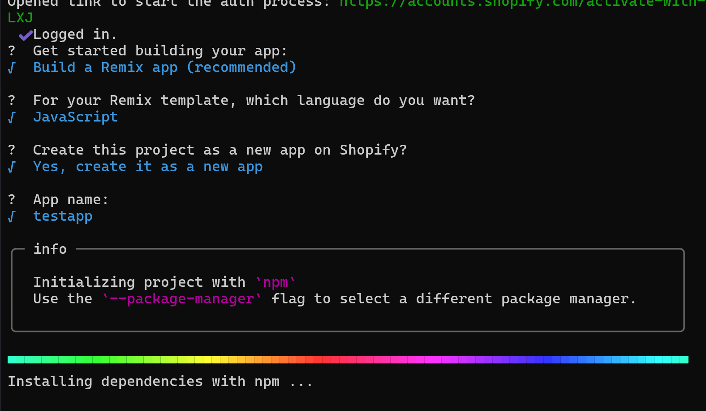
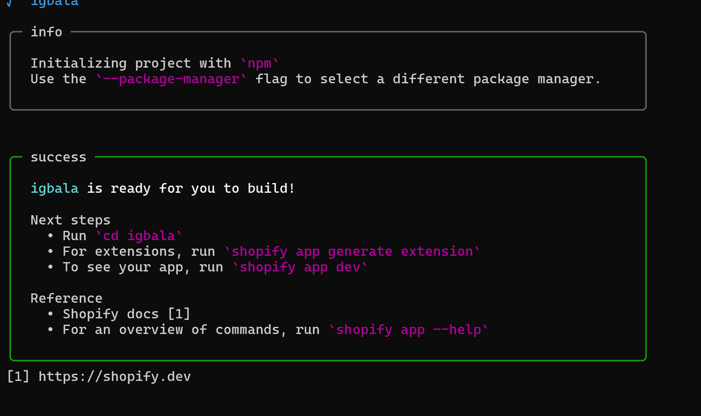
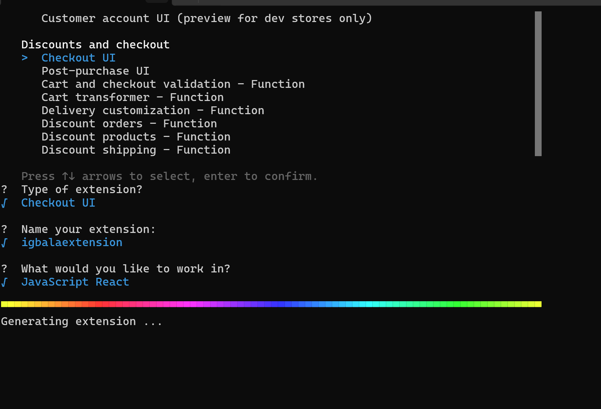

# Accept Bitcoin in Shopify with BTCPay Server

Introducing BTCPay Server for Shopify – open-source payment gateway that enables you accept bitcoin payments directly on your website or stores from customers with no fee.

Our integration with Shopify allows you connect your self-hosted BTCPay Server with your [Shopify store](https://www.shopify.com/), enabling you accept Bitcoin payments swiftly and securely.

## What BTCPay offers:

- **Zero fees**: Enjoy a payment gateway with no fees. Yes, You saw that right. Zero fees!
- **Direct payment, No middlemen or KYC**: Say goodbye to intermediaries and tedious paperwork, and get your money directly in your wallet
- **Fully automated system**: BTCPay takes care of payments, invoice management and refunds automatically.
- **Display Bitcoin QR code at checkout**: Enhance customer experience with an easy and secure payment option.
- **Self-hosted infrastructure**: Maintain full control over your payment gateway.
- **Lightning Network integrated**: Instant, fast and low cost payments and payouts
- **Easy CSV exports**
- **Versatile plugin system**: Extend functionality according to your needs
- **Point-of-sale integration** – Accept payments in your physical shops
- **Multilingual ready**: Serve a global audience right out of the box.
- **Community-driven support**: Get responsive assistance from our dedicated community ([Mattermost](http://chat.btcpayserver.org/) or [Telegram](https://t.me/btcpayserver)).

## Prerequisites:

Before diving into the setup process, ensure you have the following:

- Shopify account
- BTCPay Server - [self-hosted](Deployment.md) or run by a [third-party host](/Deployment/ThirdPartyHosting.md) v2.0.0 or later.
- [Created BTCPay Server store](CreateStore.md) with [wallet set up](WalletSetup.md)

:::warning
Shopify might give false flags on deprecated API calls. The most likely answer we could find, due to a change by Shopify to specific fields of the `Order` resource and is assumed to get used in BTCPay Server. Find more details [here](https://github.com/btcpayserver/btcpayserver/issues/4510)
:::

## Setting up BTCPay Server with Shopify

1. In Shopify, click on `Apps >` in the left sidebar
2. On the modal popped up, click on `App and sales channel settings`
3. From the page displayed, click on `Develop apps` button
4. If prompted, click on `Allow custom app development`
5. `Create an app` and name it, e.g. BTCPay Server
6. On the app page, in `Overview` tab, click on the `Configure Admin API scopes`
7. In the filter admin access scopes type in `Orders`
8. In `Orders` enable `read_orders` and `write_orders` and then click `Save`
9. Click on the API credential tab, and then click on the `Install App` in the top right corner and when pop-up window appears click `Install`
10. Reveal `Admin API access token` and `copy` it
11. In your BTCPay Server, go to your store and on the left sidebar click on `Shopify`
12. In the first field, `Shop name` enter the subdomain of your Shopify store e.g. SOME_ID.myshopify.com then enter SOME_ID
13. In the last field, `Admin API access token` paste the `Admin API access token` you just copied from Shopify
14. In the second field, `API key` paste the `API key` from Shopify - which you can find at the bottom of the same page where you copied the Admin API access token. Do the same for the third field, paste the `API Secret` from Shopify and paste in the `API Secret` filed
15. You can decide to edit the payment method description text. This basically defines the text that the user sees when the invoice loads on shopify.
16. Click `Save` on BTCPay Shopify settings page 
17. BTCPay then validates the credentials, and once validated, creates an create order webhook, and finally saves the credentials.
18. Back to Shopify, on the home page, click on `Settings` >> `Payments` in the left sidebar, scroll down to "Manual payment methods", click on `(+) Manual payment method` and select `Create custom payment method` on the dropdown.
19. In `Custom payment method name` fill in `Bitcoin with BTCPay Server`, optionally you can fill in other fields, but it's not required.
	However you would need to inform your customers that payment with Bitcoin comes on the next screen (Thank you) after checkout, so you would need to inform them in the `Additional details` of the `Manual payment method`.
	The payment option can have a delay between 2 - 10 seconds on the Thank you page, before it is displayed so this also needs to be communicated with the customers.
    	
20. Hit `Activate` and you've set up Shopify and BTCPay Server payment method successfully.

:::tip
"Custom Payment method name" **must** contain at least one of the following words (case-insensitive): `bitcoin`, `btcpayserver`, `btcpay server` or `btc` to work.
:::

Below are step by step visuals describing the process outlined above. The steps continue after the images.

### Install BTCPay-Shopify application on Shopify

The second piece of this installation guide is setting up the BTCPay-Shopify application. You can decided to host your own btcpay-shopify application 
or use the application supported by the team.

#### Using BTCPay-shopify hosted application

1. Now we need to install the BTCPay - Shopify app. Visit the [Shopify app store](https://apps.shopify.com/) search for and install the BTCPay Server plugin application
2. Once installed, you can go to your dashboard, click on `Apps >` in the left sidebar, then you would see the list of installed application, including the just installed BTCPay plugin app. 
3. Select the BTCPay app, and in the view input your BTCPay Server domain url (e.g btcpay.example.com) and the storeId to which your shopify plugin is connected on the BTCPay instance

4. In your shopify dashboard, click on `Settings`, whch is located on the bottom of the left nav panel, select `Checkout` and then `Customize`
5. In the editor change the selected page to the Thank you page

6. Click on the `Apps` icon on the left panel > `Add app block` on the bottom of the section tab
7. Click on `Sections` icon on the left panel > `Order details` > `Add app block` on the bottom of the section tab
8. Select the BTCPay Server extensions.
9. Click `Save` button on the top right corner of the page to save the changes

#### Self hosting the BTCPay-shopify application

If you are a developer or would love to have your own instance, you would need to create and deploy your own application.
##### Prerequisite:
 1. Database
 2. Cloud/Server instance to deploy your shopify application
 3. Shopify plugin installed in your BTCPay instance

##### Guidelines
1. First you would need to create a shopify partner account. You can create one using [this link](https://www.shopify.com/partners)
2. Once you have your partner account all set up, you would need to create a new shopify application. Open your command prompt and enter the command `npm init @shopify/app@latest`
3. On the prompt to select app type, make sure to select Remix application.
4. On the next prompt you get to choose the language for the application (Javascript or Typescript), choose the one more suitable for you.
5. The last prompt before the app gets created is to specify the name of the application. Whatever you type is what Shopify would recognize as the application name
6. Press enter when done, and the app would get created. Once done, you can go back to your Shopify partner dashboard and verify that it has been created.

7. Once the application has been created, the next thing is to create a checkout extension. Navigate to the working directory of your just created application: `cd igbala`
8. Run the command `shopify app generate extension` to generate an application extension.
9. Select Checout UI as type of extension, give your extension a name and select a language you would like to work with. See the image below. 

8. Now, you have your Shopify application and extension setup. Next step is to download [this repository](https://github.com/TChukwuleta/btcpayshopifyplugin). 
9. Once downloaded, open both application in your editor i.e the one you generated, and the one you downloaded.
10. You only need to install the remix install package by running the command `npm install remix-utils`
11. Replace the contents of `app > routes > app._index.jsx` in your generated application with that of the downloaded application.
12. You would need to create a new jsx file called `api.btcpaystores.jsx` in the `app > routes` folder. Copy the content of `api.btcpaystores.jsx` in the downloaded application into the just created file
13. In your `app.jsx` file, you can remove `Additional page` route link from it, as it is not important for this implementation. 
14. Now unto databases. Navigate to `prisma > schema.prisma`, update the file with the `BTCPayServerStore` model as shown in the downloaded application
	In the same file, change the provider from "sqlite" to your preferred database provider. You can leave as "sqlite" if that is your database.
	Also, change the url from "file:dev.sqlite" env("DATABASE_URL"). Create a .env file and declare a variable `DATABASE_URL` and use the connection string as the value.
15. We would need to run migraiton. On your terminal run the command `npm run prisma migrate dev --name init` to create a new migration script. 
	Shopify app uses Prisma as its orm. To learn more about migration in [Prisma](https://www.prisma.io/), you can visit this [link](https://www.prisma.io/docs/orm/prisma-migrate/getting-started)
16. To view your application so far, you can run `npm run shopify app dev` to run the application locally.
	
At this point you'd need to deploy your application to your cloud or server instance.

17. To deploy your application on your instance, would need to deploy first on Shopify, as there are some environment variables that would need to be configured.
	To deploy, run the following command: `npm run deploy`.
18. Once your application has been deployed successfully, you would see a new variable being generated in your .env file. SHOPIFY_{app_extension_name}_ID
19. The following are the enviroment variables that needs to be set successfully on your server.

	1. SHOPIFY_API_KEY => Represents the Client ID associated with the shopify app
	2. SHOPIFY_API_SECRET => Represents the Client Secret associated with the shopify app
	3. DATABASE_URL = Your database connection string
	4. SHOPIFY_BTCPAYSERVERPLUGINEXTENSION_ID => the Id generated in .env by shopify on deploy

Congratulation on deploying your application. Let's get back to our configuration
20. Now unto the extension bit, navigate to `extensions > {extension name} > src > Checkout.jsx`, copy the content in the downloaded application Checkout file to your extention app file.
21. In your shopify.extension.toml file, uncomment `network_access = true`. In the same file, change the target from `purchase.checkout.block.render` to ``
22. In your shopify.app.toml file, set `automatically_update_urls_on_dev` to false; change the value `application_url` to your deployed URL; change the base url in all `redirect_urls` to your deployed URL
23. In your Checkout.jsx file, there is a variable called `shopifyApplicaitonUrl`, replace the value with your deployed URL
24. One last change, in the package.json file, change the build value to: `"build": "prisma generate && prisma migrate deploy && remix vite:build"`
25. One more environment variable to include to the 4 listed above, SHOPIFY_APP_URL => your deployed URL
26. Once done, re-deploy your changes to shopify and your server instance. 
27. Head back to your application dashboard on your partner account. Select configuration. Confirm that the App Url and the redirection Url match your deployed URL.
28. Select `API Access` on the navigation panel. Scroll down to `Allow network access in checkout and account UI extensions` and ensure it is enabled.

Congratulations on getting here, if all goes well, you should have something as shown in the image below. You can decide to customize the view to suit business needs

Now it is time to deploy your application to the Shopify store that you are linking to BTCPay server. On your application dashboard, select distribution >> Custom distribution
Please note that selecting custom distribution would mean that you can only use the application on only one shopify store. This is irreversible.

On the next screen enter the Shopify store url that you want to link the application to.

Open the link generated on a new tab. Select the store to install the app on (ensure it matches with the store you inputted). Go ahead and install the application. 

CONGRATULATION!!!!... You made it. 

Go back to `Using BTCPay-shopify hosted application` section of this docs and continue from step 2 - 8.

## Demo Checkout flow after everything is set up:

Feel free to join our support channel over at [Mattermost](https://chat.btcpayserver.org/) or [Telegram](https://t.me/btcpayserver) if you need help or have any further questions.