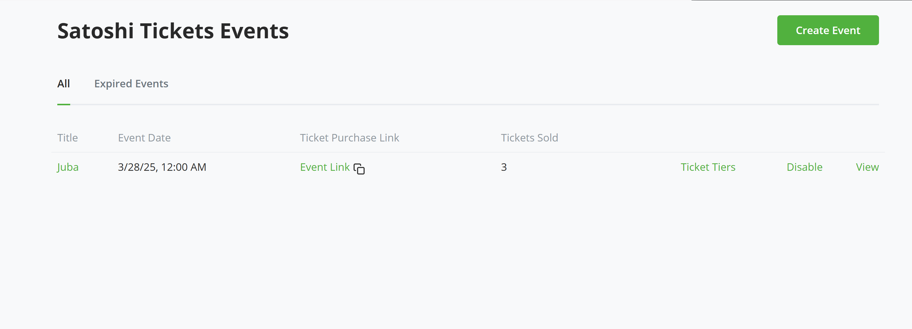

# Satoshi Tickets 

## Event Ticketing and Management System using Bitcoin via BTCPay Server

### Introduction

The Satoshi Tickets plugin enables users to sell tickets using Bitcoin payments via BTCPay Server. 

If you are an event organizer, conference host, or community managers, you can now create and manage events on your BTCPay Server instance that accept payments via Bitcoin using BTCPay Server. 

### Features

**Bitcoin Payments:** Accept Bitcoin payments securely via BTCPay Server.

**Event Creation & Management:** Organizers can create and manage events, ticket tiers, and pricing.

Automated QR Code Generation: Each ticket is linked to a unique QR code for seamless verification.

**Order & Transaction Management:** Track ticket purchases and payment confirmations.

**Decentralized and Self-Hosted:** Uses BTCPay Server, eliminating the need for third-party payment processors.

**Email Notifications:** Buyers receive confirmation emails with their QR-coded tickets.

## Prerequisites:

Before diving into the setup process, ensure you have the following:

- BTCPay Server - [self-hosted](Deployment.md) or run by a [third-party host](/Deployment/ThirdPartyHosting.md) v2.0.0 or later.

- [Created BTCPay Server store](CreateStore.md) with [wallet set up](WalletSetup.md)

## Usage Guide

1. Go to your BTCPay Server >> Manage plugins. Find and install Satoshi tickets plugin.

2. Click on create event button to create a new event. Fill necessary details about the event including the email content that would be sent on purchase as well flier/logo if any.

3. Once created successfully, you'd be redirected to a page where you would need to configure ticket tiers which would include tier name, ticket price, quantity (number of tickets for this ticket).

4. You can configure as many ticket tiers/levels as possible.

5. Navigate to the events list page. Activate the event.

6. You can now share the event link with intended event attendees, or put it up in websites, chats e.t.c. Users can now register and purchase events, and pay in Bitcoin using BTCPay Server

7. Users can select the tickets he wants to purchase and the quantity of tickets to be purchased.

8. The user is then requested to enter their name and email. This is requested to receive tickets via email and also to track order purchase.
   
Voila!!! You have completed your first ticket purchase. At this stage, an email has been sent to the buyer. The content includes the email body inputted while creating event plus a link to download tickets.

As an admin, you can navigate back to your plugin, click on "View" button for easch plugin, and view all order and ticket information regarding that particular events.

3. Validating Tickets

Use the admin panel to scan the ticket QR code.

The system verifies payment and marks the ticket as used.

POST /api/orders/{id}/verify – Verify ticket QR code

## Contribute

BTCPay Server is built and maintained entirely by contributors around the internet. We welcome and appreciate new contributions.

Do you notice any errors or bug? are you having issues with using the plugin? would you like to request a feature? or are you generally looking to support the project and plugin please [create an issue](https://github.com/TChukwuleta/BTCPayServerPlugins/issues/new)

Feel free to join our support channel over at [https://chat.btcpayserver.org/](https://chat.btcpayserver.org/) or [https://t.me/btcpayserver](https://t.me/btcpayserver) if you need help or have any further questions.